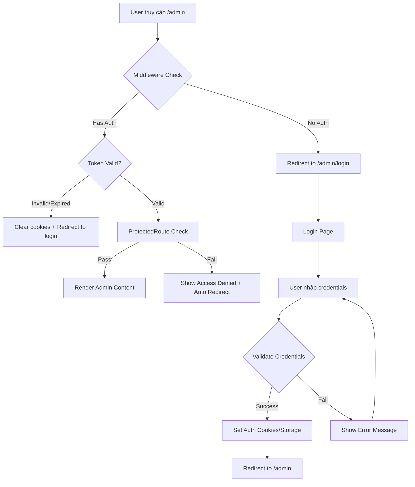

# 🔐 Quy Trình Bảo Mật Ứng Dụng

## Tổng Quan

Ứng dụng này được thiết kế với hệ thống bảo mật nhiều lớp để bảo vệ khu vực quản trị admin. Người dùng **bắt buộc phải đăng nhập** để truy cập vào bất kỳ trang admin nào.

## 🛡️ Kiến Trúc Bảo Mật

### 1. **Middleware Protection (middleware.ts)**
- **Chức năng**: Bảo vệ tất cả routes `/admin/*` trước khi request đến server
- **Kiểm tra**:
  - ✅ Cookies authentication có tồn tại
  - ✅ Token có hợp lệ (`authenticated`)
  - ✅ Token có hết hạn chưa (24 giờ)
  - ✅ User information có đầy đủ
- **Hành động**: Auto redirect đến `/admin/login` nếu fail bất kỳ check nào

### 2. **AuthContext (contexts/AuthContext.tsx)**
- **Quản lý state**: Authentication global state
- **Tính năng**:
  - 🔄 Auto-check auth status khi route change
  - ⏰ Token expiry management (24h default, 30 days với Remember Me)
  - 💾 Persistent session với localStorage + cookies
  - 🔒 Auto-logout khi tab không active (security feature)
  - 📝 Logging cho audit trail

### 3. **ProtectedRoute Component**
- **UI Protection**: Component-level protection với beautiful UX
- **Features**:
  - 🎨 Loading states khi đang check auth
  - ⚠️ Access denied screen với countdown redirect
  - ✨ Professional error handling
  - 🚀 Smooth transitions

### 4. **Enhanced Login Page**
- **Security features**:
  - 📱 Remember Me option (30 days vs 1 day)
  - 👁️ Password visibility toggle
  - 🔐 Form validation và rate limiting
  - 💬 Real-time feedback
  - 🚫 Auto-redirect nếu đã đăng nhập

## 🔄 Authentication Flow



## 🚨 Security Features

### **Token Management**
- ⏱️ **Expiry**: 24 giờ (mặc định) hoặc 30 ngày (Remember Me)
- 🍪 **Storage**: Dual storage (localStorage + httpOnly cookies)
- 🔄 **Auto-refresh**: Check tính hợp lệ khi thay đổi route
- 🧹 **Auto-cleanup**: Xóa expired tokens tự động

### **Route Protection**
- 🛡️ **Middleware-level**: Chặn request trước khi đến server
- 🎨 **Component-level**: UX protection với loading states
- 📍 **Granular**: Bảo vệ từng route riêng biệt
- 🔄 **Real-time**: Check auth status liên tục

### **Session Security**
- 🔐 **httpOnly cookies**: Bảo vệ khỏi XSS attacks
- 🔒 **Secure flags**: HTTPS-only cookies
- 🎯 **SameSite**: CSRF protection
- 👁️ **Visibility checking**: Auto-logout khi tab hidden

## 📋 Demo Credentials

```
Email: office3@genuinepartner.com
Password: 123456
```

## 🚀 Testing Security

### **1. Test Unauthenticated Access**
1. Truy cập `http://localhost:3000/admin`
2. ✅ Phải được redirect về `/admin/login`
3. ✅ Hiển thị form login

### **2. Test Authentication**
1. Đăng nhập với credentials demo
2. ✅ Phải redirect về `/admin` dashboard
3. ✅ Có thể truy cập các trang admin khác

### **3. Test Token Expiry**
1. Đăng nhập thành công
2. Đợi 24 giờ hoặc manual clear localStorage
3. ✅ Auto-logout và redirect về login

### **4. Test Remember Me**
1. Check "Ghi nhớ đăng nhập"
2. Đăng nhập thành công  
3. ✅ Token có thời hạn 30 ngày

### **5. Test Direct URL Access**
```bash
# Thử truy cập trực tiếp (không đăng nhập)
http://localhost:3000/admin/news
http://localhost:3000/admin/events
http://localhost:3000/admin/news/create
```
✅ Tất cả phải redirect về `/admin/login`

## 🛠️ Configuration

### **Thay đổi thời gian hết hạn token**
```typescript
// contexts/AuthContext.tsx
const TOKEN_EXPIRY_HOURS = 24 // Thay đổi số giờ
const REMEMBER_ME_DAYS = 30   // Thay đổi số ngày cho Remember Me

// middleware.ts  
const TOKEN_EXPIRY_HOURS = 24 // Phải match với AuthContext
```

### **Thêm routes cần bảo vệ**
```typescript
// middleware.ts
if (pathname.startsWith('/admin') || pathname.startsWith('/secure')) {
  // Logic bảo vệ
}
```

## 🔍 Monitoring & Logging

### **Auth Events được log**
- ✅ Successful login attempts
- ❌ Failed login attempts  
- 🚪 Logout events
- ⏰ Token expiry events
- 🚫 Access denied attempts

### **Check logs trong Browser Console**
```javascript
// Ví dụ logs
"User office3@genuinepartner.com logged in successfully at 2024-01-15T10:30:00.000Z"
"Access denied to /admin/news: Token expired"
"User office3@genuinepartner.com logged out at 2024-01-15T18:30:00.000Z"
```

## 🚀 Production Deployment

### **Environment Variables**
```env
# .env.local
NEXTAUTH_SECRET=your-secret-key
NEXTAUTH_URL=https://yourdomain.com
JWT_SECRET=your-jwt-secret
```

### **Additional Security Headers**
```typescript
// next.config.js
const nextConfig = {
  async headers() {
    return [
      {
        source: '/admin/:path*',
        headers: [
          {
            key: 'X-Frame-Options',
            value: 'DENY',
          },
          {
            key: 'X-Content-Type-Options',
            value: 'nosniff',
          },
        ],
      },
    ]
  },
}
```

## 📞 Support

Nếu gặp vấn đề với authentication:
1. Check Browser Console để xem logs
2. Clear localStorage và cookies
3. Kiểm tra Network tab trong DevTools
4. Verify middleware logs in terminal

---

**🛡️ Hệ thống bảo mật này đảm bảo chỉ người dùng được xác thực mới có thể truy cập vào khu vực admin!** 